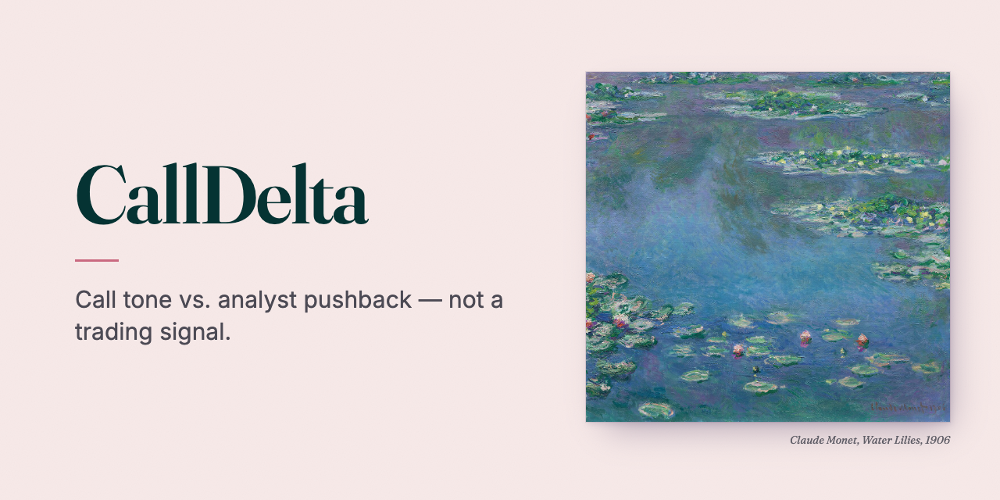
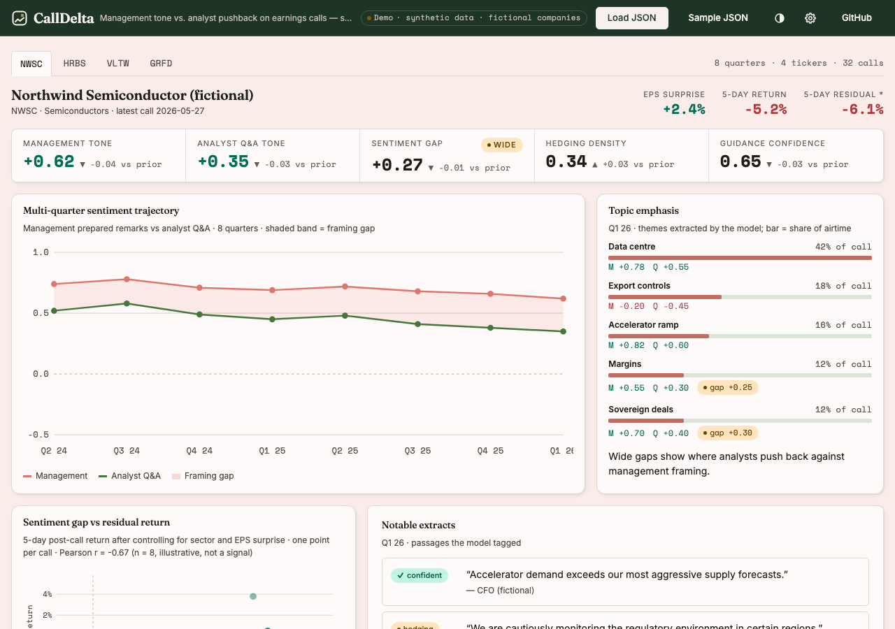
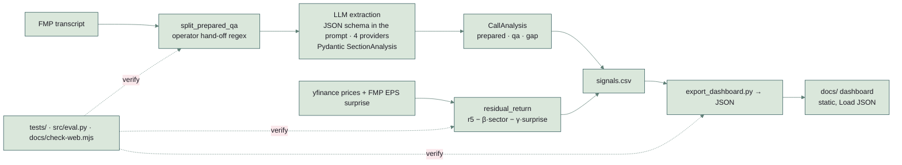

# CallDelta



**Call tone vs. analyst pushback — not a trading signal.**

An earnings call has two halves: what management chose to say, and what analysts made them answer. CallDelta scores each half separately with a fixed extraction schema, tracks the *gap* between them across quarters, and correlates it with the post-call return **after** removing the sector move and the EPS surprise — the part of the price reaction that the words, not the numbers, might explain.

> Research tooling, not a trading signal. The dashboard opens on **one real run: the four most recent earnings calls of Microsoft (FY26 Q1–Q4), Alphabet and Meta (Q3 2025–Q2 2026)**, twelve calls scored by `claude-sonnet-5` on 2026-09-25 from the transcripts each company publishes on its own investor-relations site. Four points per company show how the scores moved; they are far too few to show whether tone predicts returns, and the page says so next to the correlation.

[](https://github.com/NickkkLian/Earnings-Call-Sentiment-Analyser/actions/workflows/check.yml)



## Try it

**In the browser** — open the [dashboard](https://nickkklian.github.io/Earnings-Call-Sentiment-Analyser/) (static, no server) or `docs/index.html` from a clone. It opens on the twelve real calls above, with a link to each call's transcript page; **Load JSON** (or drag a file onto the page) replaces them with your own pipeline output, validated for shape first; **Sample JSON** (under the schema in the Methodology section) downloads a **synthetic** example file (fictional companies, invented numbers) so you can see the schema.

**What the real data contains.** Scores for the prepared remarks and for the analyst Q&A, topics, EPS surprise and the 5-day returns (EPS estimates and prices from Yahoo Finance via yfinance). Quotes come only from the prepared remarks of each company's latest call: at most 25 words each, checked word for word against the transcript, a passage with an elision or a mid-sentence fragment dropped. Analyst questions are scored but never quoted, and no analyst is named. Two companies carry a caveat on the page, taken from what they said on the calls: Alphabet's EPS in Q3 2025, Q1 2026 and Q2 2026 includes unrealized gains on equity securities, and Meta's includes a one-time tax charge (Q3 2025) and a tax benefit (Q1 2026). In those quarters the EPS-surprise control swamps the residual, so those residuals are not meaningful.

**Re-run it** — `data/ir-calls.json` lists each call's transcript URL and the SHA-256 of the file that was scored (Word files are read with the standard library, PDFs with `pdfminer.six`, MIT-licensed):

```bash
python -m src.ir_run --max-usd 3   # needs ANTHROPIC_API_KEY; stops before the estimated spend passes the cap
```

Scoring the twelve calls took 24 requests on 2026-09-25: about 256,000 input and 26,000 output tokens, roughly US$0.78 at US$2 / US$10 per million (20 requests in the final run, plus 4 for the two July PDF calls after the PDF reader changed to `pdfminer.six`).

**Run the pipeline** — Python 3.10+; keys go in `.env`, never in the repo.

```bash
pip install -r requirements.txt
cp .env.example .env   # then fill in FMP_API_KEY and the key for your model provider
```

```bash
python -m src.cli --tickers NWSC,HRBS --quarters 2025Q1,2025Q2 --provider anthropic --out signals.csv
python -m src.export_dashboard signals.csv -o dashboard_data.json
```

Replace the fictional tickers with real ones FMP has transcripts for (most US-listed large and mid caps). Then open the dashboard and load `dashboard_data.json`.

## What is interesting here

1. **Section-level decomposition.** Prepared remarks and Q&A are scored separately. The gap between them — how rosy management sounds vs. how sceptical analysts are — is the headline signal.
2. **Topic-level sentiment.** Each call is broken into 4–6 themes with separate management and Q&A tone per topic; wide topic gaps show where analysts are pushing back. Q&A-only topics (analysts raised something management did not) are surfaced on purpose.
3. **Tagged passages.** The model extracts and tags notable quotes — *confident, hedging, evasion, admission, contradiction* — not just scores.
4. **Residual return as the target.** Sentiment is correlated with the 5-day return net of the sector ETF move and net of the EPS surprise, not with the raw return (which is mostly the beat).
5. **Multi-quarter trajectory.** Single-call sentiment is noise; the *change* in tone across quarters is where any signal would live.

## How it fits together



| Layer | Choice |
| --- | --- |
| Transcripts | Financial Modeling Prep API, cached on disk |
| LLM | Your choice of Claude, OpenAI, Gemini or an OpenAI-compatible server (`--provider`, see the compatibility table below); every reply is validated into the same Pydantic models |
| Structured output | Default: the JSON schema in the prompt, parsed and validated, with one repair round. Optional `--structured native`: tool use (Anthropic) or structured outputs (OpenAI) |
| Prices / EPS | yfinance + FMP earnings-surprises endpoint |
| Wrangling | pandas |
| Dashboard | static HTML + hand-drawn SVG, no framework, no CDN scripts |

## Checks and the evaluation set

```bash
pip install -r requirements-dev.txt
python -m pytest -q
python -m src.eval
python -m src.eval --break
node docs/check-web.mjs
```

- `tests/` covers the transcript splitter (every operator phrasing the regex claims to recognise, the no-marker case, first match wins, an opening announcement of a later Q&A is not the hand-off), the quote filter for published data (prepared remarks only, 25 words, word for word, no elisions), the residual-return arithmetic and trading-day windows on a fixed synthetic series, and the dashboard export (topic merging across sections, Q&A-only topics, NaN rows dropped rather than zeroed). No network access.
- `src/eval.py` scores the extraction step on `eval/passages.json`: 30 synthetic passages (six per tag) and 10 synthetic guidance snippets. It runs through the project's own analyzer — same prompt, same schema — and records the model name and date in `eval/llm-cache.json`. The cache now holds the 2026-09-25 run with the default model, `claude-sonnet-5`: **30/30 passages and 10/10 guidance snippets** (six right out of six for each of confident, hedging, evasion, admission and contradiction). The earlier 2026-09-22 run with `claude-haiku-4-5-20251001` had the same score; its cache is in the git history. Without the cache it reports **NOT RUN** (exit code 2) rather than a made-up number. `--break` is the negative control: a cached tag outside the schema must be refused. This is a small evaluation set, not a formal evaluation pipeline — and `eval/llm-cache.json` is the whole of what that run left behind: it records the model name and date, nothing here shows a request went over the network, and a hand-written cache would be indistinguishable from it.
- `docs/check-web.mjs` asserts the dashboard loads no external scripts, that the demo and the real data pass the loader's own validation, that every real transcript source is the company's own investor-relations site and every real quote is at most 25 words, that the page opens on the real data, that mutated files are rejected with specific messages, and that the correlation helper is right.

CI runs all of the above on every push (Python 3.10 and 3.13; the eval score only once the cache exists).

## Choosing a model provider, caching

Scoring works with Claude (default), OpenAI, Google Gemini or any OpenAI-compatible endpoint (Ollama, LM Studio, vLLM, gateways):

```bash
python -m src.cli --tickers NWSC --quarters 2025Q2 --provider anthropic                    # ANTHROPIC_API_KEY
python -m src.cli --tickers NWSC --quarters 2025Q2 --provider openai                       # OPENAI_API_KEY
python -m src.cli --tickers NWSC --quarters 2025Q2 --provider gemini --model your-model-id  # GEMINI_API_KEY
python -m src.cli --tickers NWSC --quarters 2025Q2 --provider openai-compatible \
    --base-url http://localhost:11434/v1 --model your-model-id                             # LLM_API_KEY if the server needs one
```

The same variables work from `.env` (`LLM_PROVIDER`, `LLM_MODEL`, `LLM_BASE_URL`). Claude defaults to `claude-sonnet-5` and OpenAI to `gpt-4o-mini`; Gemini and OpenAI-compatible endpoints need a model id. Sonnet 5 thinks before it answers and the thinking counts toward `max_tokens`, so requests allow 16,000 output tokens; a refusal or a reply cut off at the limit is an error, never a half-read answer.

**Structured output without vendor features.** By default (`--structured json`) the analyst prompt and the Pydantic schema travel in plain text, the reply is parsed and validated locally, and a reply that does not validate gets one repair round with the validation errors — a second failure raises rather than writing a half-valid row. Nothing depends on tool calling, JSON mode or response schemas, so any model that can follow instructions can be used. The vendor-specific paths — Anthropic tool use (offered, not forced: Sonnet 5 rejects a forced tool choice), OpenAI structured outputs — remain available as `--structured native` for those two providers.

| Provider | Selected with | What has been run |
|---|---|---|
| Claude (Anthropic) | `--provider anthropic` (default) | Request and reply format, schema-in-prompt, validation, repair round and caching checked against a local mock of the documented API (`tests/test_llm_providers.py`). **Run against the live API**: the evaluation set on 2026-09-22 with `claude-haiku-4-5-20251001` and on 2026-09-25 with `claude-sonnet-5` (30 passages and 10 guidance snippets, every one tagged as the set expects both times; `eval/llm-cache.json` holds the second run), and the three real calls on the dashboard on 2026-09-25 with `claude-sonnet-5`. |
| OpenAI | `--provider openai` | Same checks against a local mock (sends `max_completion_tokens`, no `temperature`). Should work per OpenAI's documentation; **not run against the live API.** |
| Google Gemini | `--provider gemini --model …` | Same checks against a local mock; key sent in the `x-goog-api-key` header. Should work per Google's documentation; **not run against the live API.** |
| OpenAI-compatible | `--provider openai-compatible --base-url … --model …` | Same checks against a local mock. **Not run against a real Ollama, LM Studio or vLLM server.** |

Transcripts and LLM responses are cached under `./cache/`. The LLM cache key is `(provider/mode, model, prompt hash, section, text)`, so changing the provider, model, structured-output mode or prompt re-runs, and repeating the same configuration is free.

## Honest caveats

- **Sample size.** A few hundred calls is small. Treat the sentiment-gap → residual-return correlations as illustrative methodology, not a tradeable signal.
- **Lookahead bias.** The pipeline anchors all returns to the actual call date. Don't be cute with intraday data.
- **EPS-surprise control is rough.** Production work would fit `γ` per-ticker or per-sector instead of using a constant. Easy upgrade.
- **Sector proxy is crude.** SOXX / XLC / XLY etc. — fine for a portfolio project, replace with a proper factor model for real work.

**Not verified here:** the FMP transcript path has not been run for this revision (the real run used the companies' own transcripts, and EPS from Yahoo Finance because no FMP key was set); network calls are not covered by tests; the dashboard was checked in Chrome only; the model's scores are one run of one model, not checked against human labels on these calls.

## Layout

```
src/
  schema.py            Pydantic models — the contract every provider's output is validated against
  llm.py               dependency-free HTTP adapter: Anthropic, OpenAI, Gemini, OpenAI-compatible
  transcripts.py       FMP fetcher + prepared/Q&A splitter
  ir_run.py            the real run: companies' own transcripts (data/ir-calls.json) → docs/real-data.js
  prices.py            yfinance + EPS surprise + residual_return()
  analyzer.py          LLM analyzer (any of the four providers, optional native structured output, content-addressed cache)
  pipeline.py          orchestrator → DataFrame
  export_dashboard.py  DataFrame → dashboard JSON
  eval.py              evaluation set scorer (+ --llm to populate, --break negative control)
  cli.py               entry point
tests/                 splitter · residuals · export
eval/passages.json     30 tagged passages + 10 guidance snippets (synthetic)
data/ir-calls.json     the calls in the real run: company transcript URLs and SHA-256
docs/                  the dashboard (GitHub Pages root) · real-data.js · demo-data.js (Sample JSON) · check-web.mjs
DOCS.md                design notes and module-by-module developer guide
```

MIT licensed. Copyright 2026 Nick Lian.
